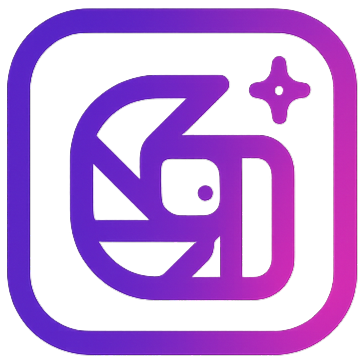

# Gen-AI Photobooth

<div align="center">

  

  <p>An AI-powered photobooth application that transforms your photos into stunning artwork using multiple artistic styles.</p>

  [](https://gen-ai-photobooth.vercel.app/)

  [](https://nuxt.com)

  [](https://www.typescriptlang.org/)
</div>

---

## 📖 Overview
Gen-AI Photobooth is a full-stack web application designed for event organizers who want to create engaging experiences and provide participants with memorable, shareable AI-generated photos. The application transforms regular photos into stunning artwork using multiple artistic styles, complete with event branding.

### 🎯 Project Goal
A Full-stack Web App that helps take pictures of people and turn them into shareable GenAI-fied versions to make events more memorable and engaging.

### 🎪 Product Vision
**For event organizers** who want to have engaging events and provide a medium for participants to reconnect with each other after the event.
The GenAI photobooth is an augmented photobooth that creates memorable branded photo experiences and makes participants engage with it.

---

### ✨ Key Capabilities
- 📸 **Mobile-First Design**: Access and use via smartphone for seamless event experience
- 🎨 **AI Photo Generation**: Transform photos into 4 artistic styles (Anime, Watercolor, Oil Painting, Disney)
- 🏷️ **Event Branding**: Upload and apply custom logos/frames to all generated photos
- 🔗 **Easy Sharing**: Generate QR codes for instant photo sharing with colleagues and friends
- 👥 **Secure Authentication**: Email/password and OAuth (Google, Discord) support
- 📱 **Responsive UI**: Polished mobile-first interface that works across all devices
**Live Demo:** [https://gen-ai-photobooth.vercel.app/](https://gen-ai-photobooth.vercel.app/)

---

## ✨ Features
### Core Features
#### 🎪 Event Organizer Features
- **🔐 Authentication & User Management**:
  - Email/password registration and login
  - OAuth integration (Google, Discord) with account linking
  - Session management with JWT tokens and automatic refresh
  - Password reset via email with secure one-time tokens
  - Comprehensive error handling for all auth scenarios
- **🏷️ Event Logo & Branding Management**:
  - Upload custom logos (PNG, JPEG, JPG, ICO, WebP, max 5MB)
  - Real-time logo preview on sample photos
  - Reselect/change logos before event creation
  - Option to proceed without logo
  - Secure storage with authentication-based access control
- **📅 Event Management**:
  - Create events with custom names and date ranges
  - Organize photo sessions by event
  - Track event participation and engagement

#### 👥 Event Participant Features
- **📷 Photo Capture**:
  - Built-in camera with live preview
  - Photo retake functionality with preview
  - Secure upload to backend storage (PNG format, max 5MB)
  - Real-time upload status and error handling
- **🎨 AI Style Generation**:
  - Generate 4 different artistic styles simultaneously:
    - Anime Style
    - Watercolor Painting  
    - Oil Painting
    - Disney Fairytale Style
  - Automatic logo overlay application on all generated photos
  - Photo selection and confirmation workflow
  - Retry options for failed generations
- **🔗 Photo Sharing**:
  - Generate time-limited QR codes (7-day expiry)
  - Lightweight share pages for easy access
  - Browser-native download and sharing options
  - Secure signed URLs that protect storage links
  - Clear error messages for expired/invalid codes

### Technical Features
#### 🚀 Performance & Scalability
- **Server-Side Rendering (SSR)**: Optimized performance with Nuxt.js
- **Mobile-First Responsive Design**: Fast loading (< 2.5s) and smooth interactions (< 200ms)
- **Scalable Architecture**: Modular design for easy feature additions
- **Efficient API**: Well-structured endpoints with TypeScript for reliability

#### 🔒 Security & Compliance
- **Secure Authentication**: OAuth2 implementation with best practices
- **Data Protection**: HTTPS transmission and secure password storage
- **Privacy Controls**: Users can access, export, and delete their data
- **Access Control**: JWT-based authorization with session management
- **Input Validation**: Comprehensive validation on all endpoints

#### 🛠️ Development & Maintenance
- **Clean Code Architecture**: Modular, well-documented codebase
- **Type Safety**: Full TypeScript implementation
- **Database ORM**: Type-safe operations with Prisma
- **Cloud Storage**: Secure Supabase storage for photo management
- **Image Processing**: Sharp integration for efficient handling
- **Cross-Platform Compatibility**: Works across browsers and operating systems

---

## 🛠️ Tech Stack
### Frontend
- **[Nuxt 4](https://nuxt.com/)**: Vue.js meta-framework with Composition API
- **[Vue 3](https://vuejs.org/)**: Progressive JavaScript framework
- **[TypeScript](https://www.typescriptlang.org/)**: Type-safe development

### Backend
- **[Nuxt Server](https://nuxt.com/docs/guide/directory-structure/server)**: Full-stack TypeScript framework
- **[TypeScript](https://www.typescriptlang.org/)**: Type-safe development
- **[Prisma](https://www.prisma.io/)**: Next-generation ORM
- **[PostgreSQL](https://www.postgresql.org/)**: Relational database
- **[Supabase](https://supabase.com/)**: Backend-as-a-Service (Auth + Storage)
  
### AI & Image Processing
- **[Leonardo AI](https://leonardo.ai/)**: AI image generation service
- **[Sharp](https://sharp.pixelplumbing.com/)**: High-performance image processing
- **[QRCode](https://www.npmjs.com/package/qrcode)**: QR code generation

### Authentication & Security
- **[Supabase Auth](https://supabase.com/docs/guides/auth)**: OAuth2 + JWT authentication
- **Google OAuth**: Social login integration
- **Discord OAuth**: Alternative social login option

### Hosting & Deployment
- **[Vercel](https://vercel.com/)**: Serverless hosting platform
- **[GitHub](https://github.com/)**: Source control and CI/CD
- **Serverless Compute**: Scalable backend infrastructure

### Development & Testing Tools
- **[Jest](https://jestjs.io/)**: Testing framework
- **[ESLint](https://eslint.org/)**: Code linting
- **[Prettier](https://prettier.io/)**: Code formatting
- **[TypeScript](https://www.typescriptlang.org/)**: Static type checking

---

## 📋 Prerequisites
Before you begin, ensure you have the following installed:
- **Node.js** (v18 or higher) - [Download](https://nodejs.org/)
- **npm** / **pnpm** / **yarn** / **bun** - Package manager
- **PostgreSQL** (v14 or higher) - [Download](https://www.postgresql.org/download/)
- **Git** - [Download](https://git-scm.com/)

### Required API Keys & Services
1. **Supabase Account**: [Sign up at supabase.com](https://supabase.com)
2. **Leonardo AI API Key**: [Get API key at leonardo.ai](https://leonardo.ai)
3. **PostgreSQL Database**: Local or hosted (Supabase, Neon, etc.)

---

## 🚀 Installation
### 1. Clone the Repository
```bash
# Replace with your actual repository URL
cd "<your-local-address>"
git clone https://github.com/IT-project-67/Gen-AI-Photobooth.git
cd genai-photobooth
```

### 2. Install Dependencies
```bash

# Using npm
npm install

# Using pnpm
pnpm install

# Using yarn
yarn install

# Using bun
bun install
```
  
### 3. Set Up Environment Variables
Create a `.env` file in the root directory (or copy from `.env.example`):
```env
# ==================================================================
# Public Environment Variables
# ==================================================================
NUXT_PUBLIC_SUPABASE_URL=https://<your-project-id>.supabase.co
NUXT_PUBLIC_SUPABASE_ANON_KEY=<your-anon-key>

# ==================================================================
# Private Runtime Configuration (Server-Only)
# ==================================================================
SUPABASE_SERVICE_ROLE_KEY=<your-service-role-key>
# PostgreSQL connection strings (used by Prisma / Supabase client)
DATABASE_URL=postgresql://postgres.<your-project-id>:<your-password>@aws-1-ap-southeast-2.pooler.supabase.com:6543/postgres?pgbouncer=true&sslmode=require
DIRECT_URL=postgresql://postgres:<your-password>@db.<your-project-id>.supabase.co:5432/postgres
# Leonardo API credentials
LEONARDO_API_KEY=<your-leonardo-api-key>

# ==================================================================
# Business / Application Configuration (Optional - has defaults)
# ==================================================================
SUPABASE_BUCKET=PhotoBooth                                    # Default: "PhotoBooth"
LEONARDO_MODEL_ID=28aeddf8-bd19-4803-80fc-79602d1a9989        # Has default value
LEONARDO_STYLE_ID=111dc692-d470-4eec-b791-3475abac4c46        # Has default value
```

**Note:** The `SUPABASE_BUCKET`, `LEONARDO_MODEL_ID`, and `LEONARDO_STYLE_ID` variables have default values and are optional. If not specified, the application will use the defaults configured in `server/config.ts`.

### 4. Set Up Database
```bash
# Generate Prisma Client
npm run db:generate

# Run database migrations
npm run db:migrate

# (Optional) Open Prisma Studio to view database
npm run db:studio
```

### 5. Configure Supabase
1. **Create a new project** in [Supabase Dashboard](https://app.supabase.com)
2. **Set up Storage Bucket:**
   - Create a storage bucket named `PhotoBooth` (or your custom name - needs to change the default value in `server/config.ts`)
   - Set bucket policies to allow authenticated users to upload/read files
3. **Enable Authentication Providers:**
   - Go to Authentication → Providers in Supabase dashboard
   - Enable **Email** provider (for email/password auth)
   - Enable **Google** OAuth:
     - Create OAuth credentials in [Google Cloud Console](https://console.cloud.google.com/)
     - Add authorized redirect URI: `https://<your-project-id>.supabase.co/auth/v1/callback`
     - Copy Client ID and Client Secret to Supabase
   - Enable **Discord** OAuth:
     - Create application in [Discord Developer Portal](https://discord.com/developers/applications)
     - Add redirect URI: `https://<your-project-id>.supabase.co/auth/v1/callback`
     - Copy Client ID and Client Secret to Supabase
4. **Configure Site URL:**
   - In Authentication → URL Configuration
   - Set Site URL to your application URL (e.g., `http://localhost:3000` for development)
   - Add redirect URLs as needed

---

## 🏃 Development
Start the development server:
```bash
npm run dev
```
The application will be available at `http://localhost:3000`
 

### Available Scripts
```bash
# Development
npm run dev              # Start development server
npm run build           # Build for production
npm run preview         # Preview production build
npm run generate        # Generate static site

# Code Quality
npm run lint            # Lint code
npm run lint:fix        # Fix linting errors
npm run format          # Format code with Prettier
npm run format:check    # Check code formatting
npm run typecheck       # Type check with TypeScript

# Database
npm run db:generate     # Generate Prisma Client
npm run db:migrate      # Run migrations
npm run db:pull         # Pull schema from database
npm run db:studio       # Open Prisma Studio
npm run db:reset        # Reset database (destructive)
```

---

## 📁 Project Structure
```
genai-photobooth/
├── app/                                 # Frontend code
│   ├── assets/                           # Static assets (CSS, images)
│   ├── components/                       # Vue components
│   │   ├── AppButton.vue
│   │   ├── AppCamera.vue
│   │   ├── AuthForm.vue
│   │   └── ...
│   ├── composables/                      # Vue composables (business logic)
│   │   ├── useAuth.ts
│   │   ├── useAiPhoto.ts
│   │   ├── useLeonardo.ts
│   │   └── ...
│   ├── layouts/                          # Layout templates
│   ├── middleware/                       # Route middleware
│   ├── pages/                            # Application routes
│   │   ├── index.vue                      # Home page
│   │   ├── login.vue                      # Login page
│   │   ├── cameraPage.vue                 # Camera page
│   │   └── ...
│   └── app.vue                           # Root component
├── server/                              # Backend code
│   ├── api/v1/                           # API routes
│   │   ├── aiphoto/                       # AI-generated images management
│   │   ├── auth/                          # Authentication endpoints
│   │   │   ├── login.post.ts
│   │   │   ├── register.post.ts
│   │   │   └── ...
│   │   ├── event/                         # Event management
│   │   │   ├── create.post.ts
│   │   │   ├── get-event-by-id.get.ts
│   │   │   ├── logo.get.ts
│   │   │   └── ...
│   │   ├── leonardo/                      # AI generation
│   │   ├── profile/                       # Profile management
│   │   ├── session/                       # Photo sessions management
│   │   └── share/                         # Photo sharing management
│   ├── clients/                          # External service clients
│   │   ├── leonardo.client.ts             # Leonardo AI client
│   │   ├── prisma.client.ts               # Database client
│   │   └── supabase.client.ts             # Supabase client
│   ├── model/                             # Data models
│   ├── types/                             # Types
│   └── utils/                             # Utility functions
├── prisma/                              # Database schema & migrations
│   ├── schema.prisma                     # Database schema
│   └── migrations/                       # Migration files
├── public/                              # Public static files
│   └── assets/                           # Static assets (images, icons)
├── tests/                               # Test suites
│   ├── server/                           # Server/backend tests
│   │   ├── api/                          # API endpoint tests
│   │   ├── model/                        # Model tests
│   │   ├── utils/                        # Utility function tests
│   │   └── jest.setup.ts                 # Server test setup
│   ├── app/                              # App/frontend tests
│   │   ├── composables/                  # Composable tests
│   │   └── jest.setup.ts                 # App test setup
│   └── tsconfig.json                     # Test TypeScript config
├── coverage/                            # Test coverage reports (auto-generated)
├── nuxt.config.ts                       # Nuxt configuration
├── tsconfig.json                        # TypeScript configuration
├── package.json                         # Dependencies
├── jest.config.mjs                      # Jest test configuration
├── babel.config.cjs                     # Babel configuration
├── eslint.config.mjs                    # ESLint configuration
├── vercel.json                          # Vercel deployment config
├── .env.example                         # Environment variables template
└── .gitignore                           # Git ignore rules
```

---

## 🗄️ Database Schema
The application uses PostgreSQL with Prisma ORM. Key entities:
### Models
- **Profile**: User profile information
- **Event**: Event details with start/end dates and logos
- **PhotoSession**: Photo capture sessions linked to events
- **AIPhoto**: AI-generated photos with style information
- **SharedPhoto**: Shareable photos with QR codes

### Relationships
```
Profile (1) ---→ (N) Event
Event (1) ---→ (N) PhotoSession
Event (1) ---→ (N) SharedPhoto
PhotoSession (1) ---→ (4) AIPhoto
PhotoSession (1) ---→ (1) SharedPhoto
```

---

## 🔌 API Documentation
### Base URL (localhost)
```
http://localhost:3000/api/v1
```

### Authentication Endpoints
| Method | Endpoint                | Description            |
| ------ | ----------------------- | ---------------------- |
| POST   | `/auth/register`        | Register new user      |
| POST   | `/auth/login`           | Login user             |
| GET    | `/auth/me`              | Get current user       |
| POST   | `/auth/forgot-password` | Request password reset |
| POST   | `/auth/reset-password`  | Reset password         |

### Profile Endpoints
| Method | Endpoint          | Description               |
| ------ | ----------------- | ------------------------- |
| GET    | `/profile`        | Get user profile          |
| PUT    | `/profile`        | Update user profile       |
| DELETE | `/profile`        | Delete user account       |
| POST   | `/profile/oauth`  | Link OAuth account        |

### Event Endpoints
| Method | Endpoint                    | Description       |
| ------ | --------------------------- | ----------------- |
| POST   | `/event/create`             | Create new event  |
| GET    | `/event/get-event-by-id`    | Get event details |
| GET    | `/event/get-events-by-user` | Get user's events |
| POST   | `/event/logo`               | Upload event logo |
| GET    | `/event/logo`               | Get event logo    |

### Photo Session Endpoints
| Method | Endpoint          | Description             |
| ------ | ----------------- | ----------------------- |
| POST   | `/session/create` | Create photo session    |
| GET    | `/session/get`    | Get session details     |
| POST   | `/session/photo`  | Upload photo to session |
| GET    | `/session/photo`  | Get session photo       |

### AI Photo Endpoints
| Method | Endpoint                           | Description                    |
| ------ | ---------------------------------- | ------------------------------ |
| POST   | `/leonardo/generate`               | Generate AI photos             |
| GET    | `/leonardo/me`                     | Get Leonardo account info      |
| GET    | `/aiphoto/aiphoto`                 | Get AI photo (blob/signed URL) |
| GET    | `/aiphoto/get-aiphoto-by-id`       | Get AI photo details           |
| GET    | `/aiphoto/get-aiphotos-by-session` | Get session's AI photos        |

### Share Endpoints
| Method | Endpoint                     | Description            |
| ------ | ---------------------------- | ---------------------- |
| POST   | `/share/create`              | Create shareable photo |
| GET    | `/share/get-share-by-id`     | Get share details      |
| GET    | `/share/get-shares-by-event` | Get event shares       |
| GET    | `/share/qrcode`              | Get QR code image      |

All authenticated endpoints require `Authorization: Bearer <token>` header.

---

## 🎨 AI Style Configuration
The application supports 4 predefined artistic styles powered by Leonardo AI. Each style is generated simultaneously to provide users with multiple options:
### Available Styles
1. **Anime Style**:
   - Transforms photos into anime/manga art style
   - Maintains original composition, faces, expressions, and background
   - Only changes the art style to anime aesthetic
2. **Watercolor Painting**:
   - Soft watercolor painting effect
   - Preserves all original elements while applying watercolor texture
   - Creates artistic, painterly appearance
3. **Oil Painting**:
   - Classic oil painting aesthetic
   - Maintains original photo elements with oil painting style
   - Rich, traditional artistic look
4. **Disney Fairytale**:
   - Disney-inspired magical style
   - Transforms photos into Disney animation aesthetic
   - Maintains original composition with magical Disney styling

### Technical Implementation
- **Parallel Generation**: All 4 styles are generated simultaneously for faster processing
- **Logo Overlay**: Event logos are automatically applied to all generated styles
- **Quality Control**: Each style uses carefully crafted prompts to maintain photo integrity
- **Error Handling**: Retry options available for failed generations
- **Storage Management**: Generated images are securely stored with unique identifiers

---

## 🌐 Deployment
### Vercel (Recommended)
1. Push your code to GitHub
2. Import project in [Vercel](https://vercel.com)
3. Add all environment variables from `.env.example` in Vercel dashboard
4. Deploy!

**Note:** The project is configured to deploy to the **Sydney (syd1)** region by default (see `vercel.json`). Change this if needed for your target audience.


#### Environment Variables in Production
Make sure to add these required environment variables in Vercel:
- `NUXT_PUBLIC_SUPABASE_URL`
- `NUXT_PUBLIC_SUPABASE_ANON_KEY`
- `SUPABASE_SERVICE_ROLE_KEY`
- `DATABASE_URL`
- `DIRECT_URL`
- `LEONARDO_API_KEY`
- `SUPABASE_BUCKET`   (has default)
- `LEONARDO_MODEL_ID` (has default)
- `LEONARDO_STYLE_ID` (has default)


### Production Build
```bash
# Build the application
npm run build

# Start production server
node .output/server/index.mjs
```

---

## 🧪 Testing
The project uses **Jest** for testing with separate test suites for server and app code.

### Test Commands
```bash
# Run all tests
npm run test:all

# Run tests with coverage report
npm run test:coverage

# Run server tests only
npm run test:server

# Run app/frontend tests only
npm run test:app

# Run setup tests
npm run test:setup

# Generate coverage reports
npm run test:coverage:server    # Server coverage
npm run test:coverage:app       # App coverage
npm run test:coverage:all       # Full coverage

# Clear Jest cache
npm run test:clearCache

# Type checking
npm run typecheck

# Linting
npm run lint
```

### Coverage Reports
After running tests with coverage, open `coverage/lcov-report/index.html` in your browser to view detailed coverage reports. (use `start coverage/lcov-report/index.html` in powershell if develop on windows)

---

## 🔒 Security & Compliance
### Authentication & Authorization
- **JWT-based Authentication**: Secure token-based authentication via Supabase
- **OAuth2 Implementation**: Google and Discord OAuth with secure best practices
- **Session Management**: Automatic token refresh and secure session handling
- **Password Security**: Secure password hashing and storage
- **Access Control**: Only authenticated users can upload photos and generate QR codes

### Data Protection
- **HTTPS Transmission**: All data transmitted over secure HTTPS connections (enforced by hosting platform)
- **Environment Variables**: Sensitive data stored in secure environment variables
- **Input Validation**: Comprehensive validation on all API endpoints with type checking
- **CORS Configuration**: Proper cross-origin resource sharing setup in Nuxt config
- **Secure File Upload**: File type and size validation for all uploads

### Privacy & User Rights
- **Data Control**: Users can access, update, and delete their personal data via profile API
- **Secure Storage**: Direct storage URLs are never exposed; only signed URLs via QR codes
- **Time-Limited Access**: QR codes expire after 7 days for enhanced privacy
- **Authentication Required**: Only authenticated users can upload photos and generate QR codes
- **Session Management**: Automatic token refresh and secure session handling via Supabase

---

## 🔧 Troubleshooting

### Common Issues and Solutions

#### Database Connection Issues
**Problem:** Cannot connect to PostgreSQL database
**Solutions:**
- Verify `DATABASE_URL` and `DIRECT_URL` in `.env` are correct
- Check if your IP address is whitelisted in Supabase dashboard
- Ensure PostgreSQL service is running
- Try running `npm run db:generate` to regenerate Prisma client

#### Supabase Storage Issues
**Problem:** Cannot upload photos or images not displaying
**Solutions:**
- Verify `SUPABASE_BUCKET` name matches your bucket in Supabase (Default 'PhotoBooth')
- Check bucket policies allow authenticated users to read/write
- Ensure `SUPABASE_SERVICE_ROLE_KEY` is set correctly
- Verify file size is under the limit (5MB for all uploads)

#### Leonardo AI Generation Failures
**Problem:** AI photo generation fails or times out
**Solutions:**
- Verify `LEONARDO_API_KEY` is valid and active
- Check Leonardo AI account has sufficient credits
- Ensure your API key has permission to use the specified model
- Try using default `LEONARDO_MODEL_ID` and `LEONARDO_STYLE_ID`
- Leonardo AI may have rate limits - wait a few minutes and retry

#### OAuth Login Issues
**Problem:** Google or Discord login not working
**Solutions:**
- Verify OAuth redirect URIs are configured correctly:
  - Should be: `https://<your-project-id>.supabase.co/auth/v1/callback`
- Check Client ID and Client Secret are correct in Supabase dashboard
- Ensure the OAuth providers are enabled in Supabase Auth settings
- Verify Site URL is set correctly in Supabase dashboard

#### Image Upload Timeout
**Problem:** Photo upload takes too long or fails
**Solutions:**
- Check your internet connection speed
- Ensure image is under 5MB
- Try compressing the image before upload
- Check Supabase storage bucket exists and is accessible

#### Build or Development Errors
**Problem:** `npm run dev` fails or build errors
**Solutions:**
- Delete `node_modules` and `.nuxt` folders, then run `npm install` again
- Clear Nuxt cache: `rm -rf .nuxt .output`
- Verify Node.js version is 18 or higher: `node --version`
- Run `npm run db:generate` to ensure Prisma client is up to date
- Check for TypeScript errors: `npm run typecheck`

#### Environment Variables Not Loading
**Problem:** Application can't read environment variables
**Solutions:**
- Ensure `.env` file is in the project root directory
- Restart the development server after changing `.env`
- Check variable names match exactly (case-sensitive)
- For public variables, ensure they start with `NUXT_PUBLIC_`
- In production (Vercel), verify all variables are set in dashboard

#### Test Failures
**Problem:** Tests failing after changes
**Solutions:**
- Clear Jest cache: `npm run test:clearCache`
- Ensure test database is properly configured
- Check if environment variables are set for tests
- Run tests individually to isolate issues: `npm run test:server` or `npm run test:app` or `npm run test:all`

### Getting Help
If you encounter issues not listed here:
1. Check the [Nuxt.js documentation](https://nuxt.com/docs)
2. Review [Supabase documentation](https://supabase.com/docs)
3. Check [Leonardo AI documentation](https://docs.leonardo.ai/)
4. Search existing GitHub issues
5. Create a new GitHub issue with detailed error messages and steps to reproduce

---

## 🤝 Contributing
Contributions are welcome! Please follow these steps:
1. Fork the repository
2. Create a feature branch (`git checkout -b feature/AmazingFeature`)
3. Commit your changes (`git commit -m 'feature(feat): Add some AmazingFeature'`)
4. Push to the branch (`git push origin feature/AmazingFeature`)
5. Open a Pull Request

### Development Guidelines
- Follow TypeScript best practices
- Use ESLint and Prettier for code formatting
- Write meaningful commit messages
- Add comments for complex logic
- Update documentation as needed

---

## 👨‍💻 Authors
- UniMelb IT Project Group 67

---

## 🙏 Acknowledgments
- [Leonardo AI](https://leonardo.ai/) for AI image generation
- [Supabase](https://supabase.com/) for authentication and storage
- [Nuxt.js](https://nuxt.com/) team for the amazing framework
- [Prisma](https://www.prisma.io/) for the excellent ORM